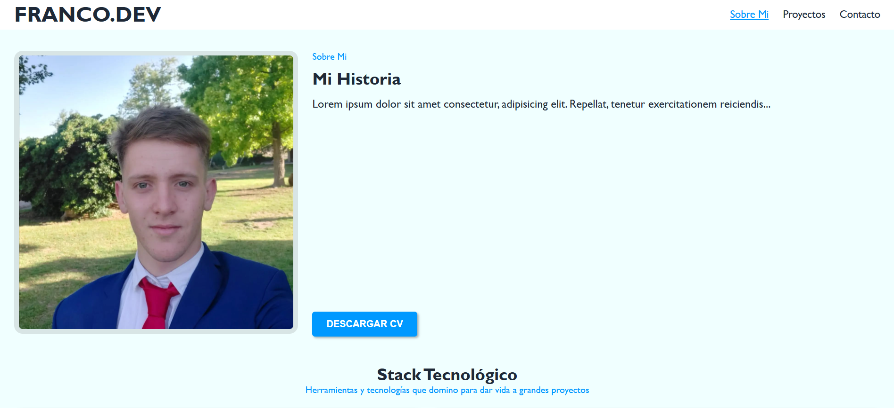

# 🚀 FRANCO.DEV - Portafolio Personal

¡Bienvenido! Este es mi portafolio web personal, desarrollado desde cero con tecnologías web nativas. Construí este proyecto con el objetivo principal de consolidar y llevar al siguiente nivel mis habilidades prácticas en **HTML5**, **CSS3 (Moderno)** y **JavaScript Vainilla**.

El sitio cuenta con un diseño totalmente responsivo, animaciones sutiles y una navegación inteligente pensada en la experiencia de usuario (UX).

---

## 🛠️ Tecnologías Utilizadas

* **HTML5:** Estructuración semántica y accesible de las secciones.
* **CSS3 (Moderno):** Uso avanzado de **CSS Grid**, **Flexbox**, anidamiento nativo (*Nesting*) y efectos visuales como *Glassmorphism*.
* **JavaScript (ES6+):** Programación lógica nativa estructurada como módulos, sin depender de librerías o frameworks pesados.

---

## 🌟 Características Destacadas & Desafíos Resueltos

Durante el desarrollo de este portafolio, me enfoqué en solucionar problemáticas reales de la maquetación y la interactividad web:

* **Efecto Scrollspy Dinámico:** Implementación de la API nativa `IntersectionObserver` en JavaScript para detectar de manera ultra eficiente qué sección está viendo el usuario y resaltar automáticamente su enlace correspondiente en la barra de navegación.
* **Menú Lateral Responsive (Sidebar):** Creación de un menú hamburguesa interactivo para dispositivos móviles que utiliza transiciones fluidas de CSS y lógica asíncrona para cerrarse al seleccionar un destino.
* **Cabecera Sticky Inteligente:** Uso de `position: sticky` combinado con la propiedad moderna `scroll-margin-top` para evitar que el header fijo tape los títulos de los artículos al realizar saltos de navegación.
* **Paleta de Colores Tecnológica:** Elección minuciosa de tonos (*Azure*, *Antracita* para legibilidad y acentos en *Azul Eléctrico*) que transmiten una estética limpia, profesional y moderna.

---

## 📸 Vista Previa del Proyecto

---

## 🎯 Próximos Pasos / Roadmap
* [ ] Añadir filtros funcionales con JS para la grilla de proyectos (Todos / Web / Mobile).
* [ ] Integrar un servicio de envío real para el formulario de contacto (ej. Formspree o EmailJS).
* [ ] Optimizar la carga de imágenes usando formatos de nueva generación (.webp).

---